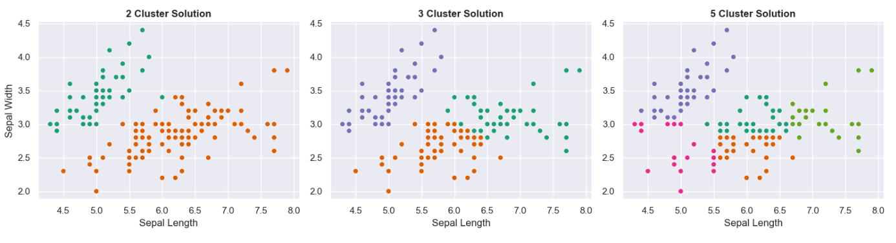
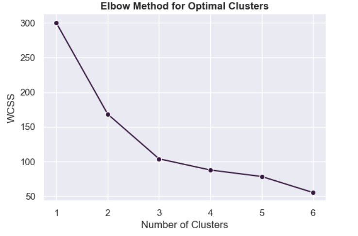
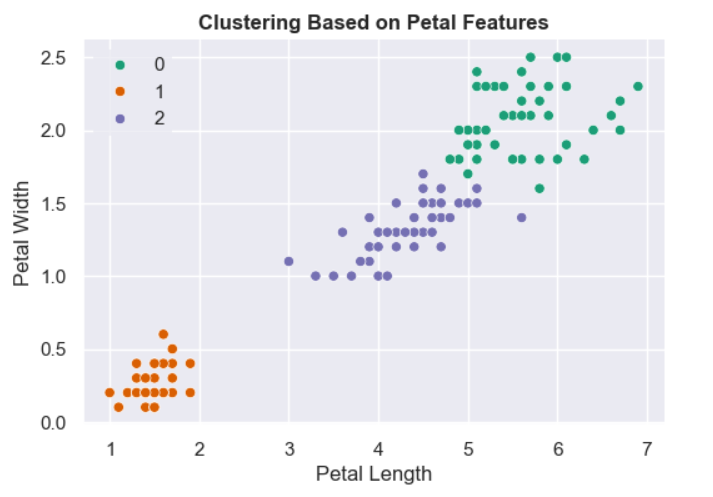

# Species Segmentation with Clustering: A Case Study on Its Limitations

The **Iris flower dataset**, also known as Fisher's Iris dataset, is a classic multivariate dataset made famous by British statistician and biologist [**Ronald Fisher**](https://en.wikipedia.org/wiki/Iris_flower_data_set) in his 1936 paper *The Use of Multiple Measurements*. It consists of 150 samples of iris flowers across three species—*Iris setosa*, *Iris versicolor*, and *Iris virginica*—with four measured features: `sepal length`, `sepal width`, `petal length`, and `petal width`.

Although widely used in supervised learning tasks, the dataset is rarely used for clustering (unsupervised learning) due to a specific biological **limitation**:

* One species (*Iris setosa*) is linearly separable from the other two.
* The remaining two species (*versicolor* and *virginica*) have overlapping feature distributions that make them indistinguishable without species labels.

This project uses K-means clustering to explore the dataset from an **unsupervised learning perspective**. It demonstrates:

* How feature selection and scaling affect clustering results
* How the **Elbow Method** can guide (but not guarantee) cluster selection
* Why **cluster labels ≠ class labels** and the importance of domain knowledge in interpreting unsupervised results

By the end of the project, we reflect on the **limitations of K-means** for biological datasets and contrast this with what supervised models like logistic regression can offer when labels are known.




## 📁 Project Structure

```plaintext
iris_species_cluster_analysis_case_study/
├── dataset/
│   └── iris-dataset.csv
├── notebook/
│   └── iris_species_segmentation.ipynb
├── visuals/
├── README.md
```

### Key Takeaways:
- The Elbow Method is useful, but **not always definitive** (e.g. suggests 2 or 5 clusters instead of the known 3).
- Clustering on **petal features** better reflects the known biological categories.
- This demonstrates a key limitation of k-means: clusters do not always map to **real-world classes**.



### Next Steps:
- We could now use logistic regression or classification using the known species labels for making prediction.


---
*© 2025 All rights are reserved.*
